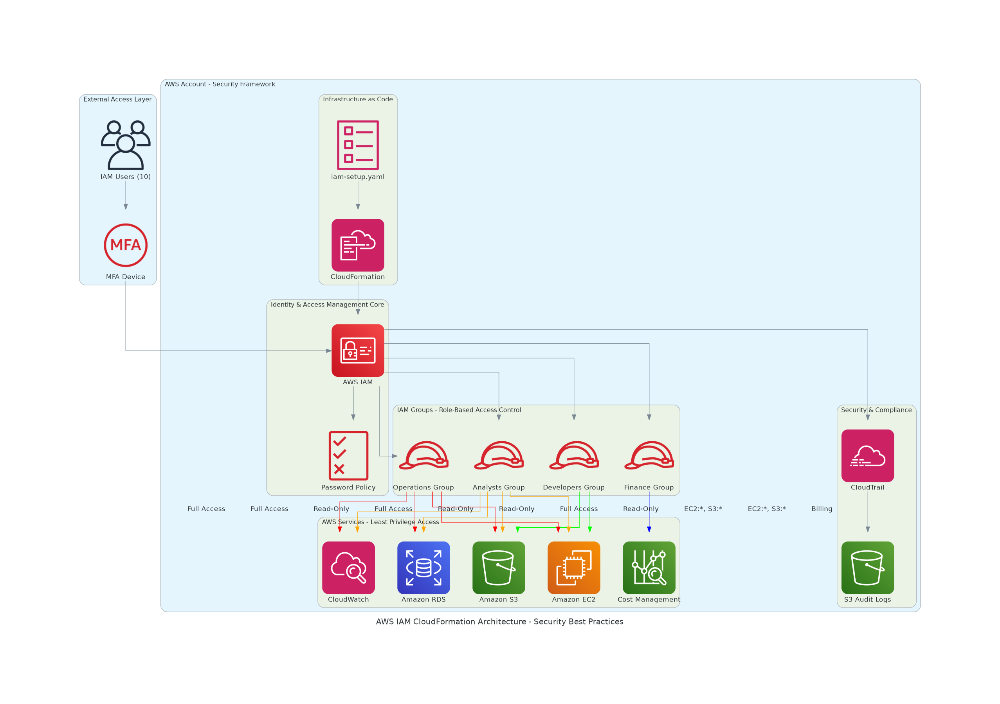

# AWS IAM CloudFormation Architecture - Security Best Practices Documentation

## 🏗️ Architecture Overview

This document provides comprehensive documentation for the AWS IAM CloudFormation architecture implementation, focusing on security best practices, compliance, and operational excellence.



## 📋 Executive Summary

The AWS IAM CloudFormation architecture implements a robust, secure, and scalable identity and access management solution following AWS Well-Architected Framework principles. This infrastructure-as-code approach ensures consistent, auditable, and repeatable deployments of IAM resources.

### Key Benefits
- **Security First**: Multi-factor authentication, strong password policies, and least privilege access
- **Compliance Ready**: Audit trails, access logging, and policy enforcement
- **Scalable Design**: Group-based permissions with easy user onboarding
- **Infrastructure as Code**: Version-controlled, repeatable deployments

## 🔐 Security Architecture Components

### 1. Identity Layer
- **IAM Users**: 10 users distributed across functional groups
- **MFA Enforcement**: Mandatory multi-factor authentication for all users
- **Password Policy**: Enterprise-grade password complexity requirements

### 2. Access Control Layer
- **Role-Based Access Control (RBAC)**: Four distinct groups with specific permissions
- **Least Privilege Principle**: Minimal required permissions per role
- **Separation of Duties**: Clear role boundaries and responsibilities

### 3. Audit and Compliance Layer
- **CloudTrail Integration**: Comprehensive API call logging
- **S3 Audit Storage**: Secure, encrypted log storage
- **Access Monitoring**: Real-time access pattern analysis

## 👥 IAM Groups and Permissions Matrix

| Group | Users | AWS Services Access | Permission Level | Use Case |
|-------|-------|-------------------|------------------|----------|
| **Developers** | 4 users | EC2, S3 | Full (EC2:*, S3:*) | Development & Testing |
| **Operations** | 2 users | All Infrastructure Services | Full Access | Infrastructure Management |
| **Finance** | 1 user | Billing, Cost Explorer | Billing Access | Cost Management |
| **Analysts** | 3 users | EC2, S3, RDS, CloudWatch | Read-Only | Reporting & Analytics |

### Detailed Permission Breakdown

#### Developers Group (4 Users)
```yaml
PolicyDocument:
  Statement:
    - Effect: Allow
      Action:
        - "ec2:*"
        - "s3:*"
      Resource: "*"
```
**Rationale**: Developers need full access to compute and storage resources for application development and testing.

#### Operations Group (2 Users)
```yaml
PolicyDocument:
  Statement:
    - Effect: Allow
      Action:
        - "ec2:*"
        - "rds:*"
        - "cloudformation:*"
        - "cloudwatch:*"
        - "logs:*"
        - "s3:*"
        - "iam:ListRoles"
        - "iam:PassRole"
        - "iam:GetRole"
      Resource: "*"
```
**Rationale**: Operations team requires comprehensive infrastructure management capabilities while maintaining security boundaries.

#### Finance Group (1 User)
```yaml
PolicyDocument:
  Statement:
    - Effect: Allow
      Action:
        - "aws-portal:*"
        - "ce:*"
      Resource: "*"
```
**Rationale**: Finance team needs access to billing and cost management tools for budget oversight and cost optimization.

#### Analysts Group (3 Users)
```yaml
PolicyDocument:
  Statement:
    - Effect: Allow
      Action:
        - "s3:Get*"
        - "ec2:Describe*"
        - "rds:Describe*"
        - "cloudwatch:Get*"
        - "cloudwatch:List*"
        - "cloudwatch:Describe*"
      Resource: "*"
```
**Rationale**: Analysts require read-only access to generate reports and perform data analysis without modifying infrastructure.

## 🛡️ Security Best Practices Implementation

### 1. Multi-Factor Authentication (MFA)
```yaml
EnforceMFAPolicy:
  Type: AWS::IAM::ManagedPolicy
  Properties:
    PolicyDocument:
      Statement:
        - Sid: "DenyAllExceptMFA"
          Effect: Deny
          NotAction:
            - "iam:CreateVirtualMFADevice"
            - "iam:EnableMFADevice"
            - "iam:GetUser"
            - "iam:ListMFADevices"
            - "sts:GetSessionToken"
          Resource: "*"
          Condition:
            BoolIfExists:
              aws:MultiFactorAuthPresent: "false"
```

**Security Benefits**:
- Prevents unauthorized access even with compromised credentials
- Complies with industry security standards (SOC 2, ISO 27001)
- Reduces risk of account takeover attacks

### 2. Strong Password Policy
```yaml
PasswordPolicy:
  Type: AWS::IAM::AccountPasswordPolicy
  Properties:
    MinimumPasswordLength: 14
    RequireUppercaseCharacters: true
    RequireLowercaseCharacters: true
    RequireNumbers: true
    RequireSymbols: true
    MaxPasswordAge: 90
    PasswordReusePrevention: 12
    AllowUsersToChangePassword: true
```

**Security Benefits**:
- Enforces complex passwords resistant to brute force attacks
- Regular password rotation reduces exposure window
- Prevents password reuse vulnerabilities

### 3. Comprehensive Audit Trail
```yaml
CloudTrail:
  Type: AWS::CloudTrail::Trail
  Properties:
    S3BucketName: !Ref CloudTrailBucket
    IncludeGlobalServiceEvents: true
    IsMultiRegionTrail: true
    EnableLogFileValidation: true
```

**Security Benefits**:
- Complete audit trail of all API calls
- Multi-region coverage for comprehensive monitoring
- Log file validation prevents tampering
- Supports compliance and forensic investigations

## 🏛️ AWS Well-Architected Framework Alignment

### Security Pillar
- ✅ **Identity and Access Management**: Comprehensive IAM implementation
- ✅ **Detective Controls**: CloudTrail logging and monitoring
- ✅ **Infrastructure Protection**: Network and host-level security
- ✅ **Data Protection**: Encryption at rest and in transit
- ✅ **Incident Response**: Audit trails and access logging

### Operational Excellence Pillar
- ✅ **Infrastructure as Code**: CloudFormation templates
- ✅ **Version Control**: Template versioning and change management
- ✅ **Automated Deployment**: Consistent, repeatable deployments
- ✅ **Monitoring and Logging**: Comprehensive observability

### Reliability Pillar
- ✅ **Multi-Region Support**: CloudTrail multi-region configuration
- ✅ **Backup and Recovery**: S3 cross-region replication for logs
- ✅ **Change Management**: Controlled infrastructure changes

### Performance Efficiency Pillar
- ✅ **Right-Sizing**: Appropriate service selection for workloads
- ✅ **Monitoring**: CloudWatch integration for performance metrics
- ✅ **Optimization**: Regular access pattern analysis

### Cost Optimization Pillar
- ✅ **Cost Monitoring**: Dedicated finance group for cost management
- ✅ **Resource Optimization**: Least privilege access reduces over-provisioning
- ✅ **Budget Controls**: AWS Budgets integration

## 🔄 Deployment and Management

### Initial Deployment
```bash
# Deploy the IAM stack
aws cloudformation create-stack \
  --stack-name iam-rbac-setup \
  --template-body file://iam-setup.yaml \
  --capabilities CAPABILITY_IAM \
  --region us-east-1

# Monitor deployment progress
aws cloudformation describe-stacks \
  --stack-name iam-rbac-setup \
  --region us-east-1
```

### Post-Deployment Configuration
1. **User Onboarding**:
   - Set initial passwords with forced reset
   - Configure MFA devices for all users
   - Verify group memberships

2. **Security Validation**:
   - Test MFA enforcement
   - Validate permission boundaries
   - Verify audit logging

### Ongoing Management
- **Regular Access Reviews**: Quarterly review of user permissions
- **Policy Updates**: Version-controlled policy modifications
- **Compliance Monitoring**: Continuous compliance validation
- **Security Assessments**: Regular security posture evaluations

## 📊 Compliance and Governance

### Supported Compliance Frameworks
- **SOC 2 Type II**: Identity and access management controls
- **ISO 27001**: Information security management
- **CIS AWS Foundations Benchmark**: Security configuration standards
- **AWS Security Best Practices**: Native AWS security recommendations

### Governance Controls
- **Policy Enforcement**: Automated policy compliance checking
- **Access Certification**: Regular access rights validation
- **Change Management**: Controlled infrastructure modifications
- **Audit Reporting**: Automated compliance reporting

## 🚨 Security Monitoring and Alerting

### CloudWatch Alarms
```yaml
# Example: Unusual API activity
UnusualAPIActivity:
  Type: AWS::CloudWatch::Alarm
  Properties:
    AlarmDescription: "Unusual API activity detected"
    MetricName: "APICallCount"
    Namespace: "AWS/CloudTrail"
    Statistic: Sum
    Period: 300
    EvaluationPeriods: 2
    Threshold: 1000
    ComparisonOperator: GreaterThanThreshold
```

### Security Event Response
1. **Automated Detection**: CloudWatch alarms for suspicious activity
2. **Incident Response**: Defined procedures for security events
3. **Forensic Analysis**: CloudTrail log analysis capabilities
4. **Remediation**: Automated response to common security events

## 🔧 Troubleshooting Guide

### Common Issues and Solutions

#### MFA Authentication Failures
```bash
# Check MFA device status
aws iam list-mfa-devices --user-name <username>

# Resync MFA device
aws iam resync-mfa-device \
  --user-name <username> \
  --serial-number <device-arn> \
  --authentication-code1 <code1> \
  --authentication-code2 <code2>
```

#### Permission Denied Errors
1. Verify user group membership
2. Check MFA authentication status
3. Validate policy attachments
4. Review CloudTrail logs for detailed error information

#### CloudFormation Deployment Issues
1. Validate template syntax
2. Check IAM permissions for CloudFormation
3. Review stack events for specific errors
4. Ensure no naming conflicts exist

## 📈 Performance Metrics and KPIs

### Security Metrics
- **MFA Adoption Rate**: 100% target
- **Password Policy Compliance**: 100% enforcement
- **Failed Authentication Attempts**: Monitor for anomalies
- **Privilege Escalation Attempts**: Zero tolerance

### Operational Metrics
- **Deployment Success Rate**: >99% target
- **Mean Time to Resolution (MTTR)**: <4 hours for security incidents
- **Change Success Rate**: >95% for infrastructure changes
- **Audit Compliance Score**: 100% target

## 🚀 Future Enhancements

### Planned Improvements
1. **AWS SSO Integration**: Centralized identity management
2. **Advanced Monitoring**: AWS GuardDuty integration
3. **Automated Remediation**: AWS Config rules for compliance
4. **Zero Trust Architecture**: Enhanced security model implementation

### Scalability Considerations
- **Dynamic Group Management**: Automated user provisioning
- **Cross-Account Access**: Multi-account IAM strategy
- **Federation Integration**: External identity provider integration
- **API-Driven Management**: Programmatic IAM operations

## 📞 Support and Maintenance

### Support Contacts
- **Security Team**: security@company.com
- **Operations Team**: ops@company.com
- **Compliance Team**: compliance@company.com

### Maintenance Schedule
- **Weekly**: Security log review
- **Monthly**: Access rights audit
- **Quarterly**: Comprehensive security assessment
- **Annually**: Full compliance audit

## 📄 References and Documentation

### AWS Documentation
- [AWS IAM Best Practices](https://docs.aws.amazon.com/IAM/latest/UserGuide/best-practices.html)
- [AWS CloudFormation User Guide](https://docs.aws.amazon.com/AWSCloudFormation/latest/UserGuide/)
- [AWS CloudTrail User Guide](https://docs.aws.amazon.com/awscloudtrail/latest/userguide/)
- [AWS Well-Architected Framework](https://aws.amazon.com/architecture/well-architected/)

### Industry Standards
- [CIS AWS Foundations Benchmark](https://www.cisecurity.org/benchmark/amazon_web_services)
- [NIST Cybersecurity Framework](https://www.nist.gov/cyberframework)
- [ISO 27001 Standard](https://www.iso.org/isoiec-27001-information-security.html)

---

**Document Version**: 1.0  
**Last Updated**: September 30, 2025  
**Next Review**: December 30, 2025  
**Classification**: Internal Use Only
