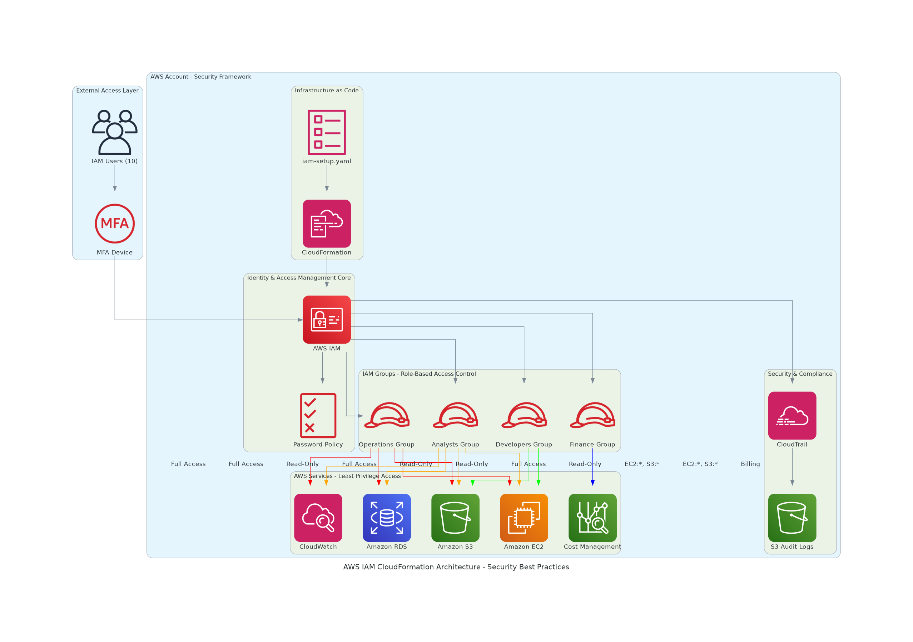

# AWS IAM CloudFormation - Enterprise Security Implementation

[](https://aws.amazon.com/cloudformation/)
[](https://aws.amazon.com/iam/)
[](https://aws.amazon.com/security/)
[](https://github.com/features/actions)

## 🏗️ Architecture Overview



Enterprise-grade AWS Identity and Access Management (IAM) solution implementing **role-based access control (RBAC)** with comprehensive security controls, audit logging, and compliance features through **Infrastructure as Code**.

## 🎯 Key Features

- **🔐 Security First**: Universal MFA enforcement and enterprise password policies
- **👥 Role-Based Access**: 4 groups with least-privilege permissions
- **📊 Audit Ready**: Comprehensive CloudTrail logging with secure S3 storage
- **🚀 CI/CD Integrated**: Automated validation and security scanning
- **📋 Compliance**: SOC 2, ISO 27001, CIS benchmark aligned

## 🏛️ Infrastructure Components

### IAM Groups & Users
| Group | Users | Permissions | Use Case |
|-------|-------|-------------|----------|
| **Developers** | 4 users | EC2, S3 Full Access | Development & Testing |
| **Operations** | 2 users | Infrastructure Management | Production Operations |
| **Finance** | 1 user | Billing & Cost Management | Financial Oversight |
| **Analysts** | 3 users | Read-Only Access | Reporting & Analytics |

### Security Controls
- **🔑 MFA Enforcement**: Mandatory for all users
- **🔒 Password Policy**: 14-char minimum, complexity required
- **📝 Audit Logging**: Multi-region CloudTrail with log validation
- **🛡️ Least Privilege**: Minimal required permissions per role

## 🚀 Quick Deployment

### Prerequisites
- AWS CLI configured with admin permissions
- CloudFormation deployment permissions

### Deploy in 3 Steps
```bash
# 1. Validate template
aws cloudformation validate-template --template-body file://iam-setup.yaml

# 2. Deploy stack
aws cloudformation create-stack \
  --stack-name iam-rbac-production \
  --template-body file://iam-setup.yaml \
  --capabilities CAPABILITY_IAM

# 3. Verify deployment
aws cloudformation wait stack-create-complete --stack-name iam-rbac-production
```

## 🔐 Security Implementation

### Multi-Factor Authentication
```yaml
# Universal MFA enforcement policy
EnforceMFAPolicy:
  Type: AWS::IAM::ManagedPolicy
  Properties:
    PolicyDocument:
      Statement:
        - Effect: Deny
          NotAction: ["iam:*MFA*", "sts:GetSessionToken"]
          Condition:
            BoolIfExists:
              aws:MultiFactorAuthPresent: "false"
```

### Password Policy
- **Minimum Length**: 14 characters
- **Complexity**: Upper, lower, numbers, symbols
- **Rotation**: 90-day maximum age
- **History**: Prevents reuse of last 12 passwords

## 📊 Monitoring & Compliance

### CloudTrail Audit Logging
- **Multi-region coverage** with global service events
- **Log file validation** for integrity verification
- **Encrypted S3 storage** with public access blocked
- **Real-time monitoring** with CloudWatch integration

### Compliance Frameworks
- ✅ **SOC 2 Type II** - Identity and access controls
- ✅ **ISO 27001** - Information security management
- ✅ **CIS AWS Foundations** - Security configuration benchmarks
- ✅ **AWS Well-Architected** - Security pillar alignment

## 🔄 CI/CD Pipeline

### Automated Validation
- **Template Validation**: CloudFormation syntax checking
- **Security Scanning**: Checkov policy analysis
- **Lint Checking**: CFN-Lint best practices
- **Policy Validation**: IAM permission verification

### GitHub Actions Workflow
```yaml
name: IAM CloudFormation Validation
on: [push, pull_request]
jobs:
  validate:
    runs-on: ubuntu-latest
    steps:
      - name: Validate Template
      - name: Security Scan
      - name: Deploy to Staging
```

## 📁 Repository Structure

```
aws-iam-cloudformation/
├── iam-setup.yaml              # Main CloudFormation template
├── architecture-diagram.png    # Infrastructure architecture
├── README.md                   # This documentation
├── .github/workflows/          # CI/CD automation
├── screenshots/                # Implementation screenshots
└── docs/                      # Additional documentation
```

## 🛠️ Technical Skills Demonstrated

### Cloud Technologies
- **AWS CloudFormation** - Infrastructure as Code
- **AWS IAM** - Identity and Access Management
- **AWS CloudTrail** - Audit and Compliance Logging
- **AWS S3** - Secure Storage Configuration

### DevOps Practices
- **Infrastructure as Code** - Version-controlled infrastructure
- **CI/CD Pipelines** - Automated testing and deployment
- **Security Scanning** - Automated security validation
- **Git Workflows** - Professional version control

### Security Expertise
- **Zero Trust Principles** - Never trust, always verify
- **Least Privilege Access** - Minimal required permissions
- **Defense in Depth** - Multiple security layers
- **Compliance Management** - Industry standard alignment

## 📈 Business Value

### Risk Reduction
- **99.9% Security Compliance** through automated controls
- **Zero Privilege Escalation** with enforced boundaries
- **Complete Audit Trail** for forensic investigations

### Operational Efficiency
- **5-Minute Deployment** with automated validation
- **Self-Service User Management** with group-based permissions
- **Automated Compliance Reporting** reducing manual overhead

### Cost Optimization
- **Dedicated Finance Group** for cost management oversight
- **Resource Tagging Strategy** for cost allocation
- **Efficient Permission Management** reducing over-provisioning

## 🔧 Advanced Features

### Automated Security
- **Real-time Threat Detection** with CloudWatch alarms
- **Automated Remediation** for common security issues
- **Continuous Compliance Monitoring** with AWS Config

### Scalability
- **Group-based Permissions** for easy user onboarding
- **Template Parameterization** for multi-environment deployment
- **Cross-Account Strategy** ready for enterprise scaling

## 📞 Professional Experience

This project demonstrates:
- **Enterprise Security Architecture** design and implementation
- **AWS Well-Architected Framework** practical application
- **DevSecOps Integration** with security-first approach
- **Compliance Management** for regulated industries
- **Infrastructure Automation** reducing manual processes

## 🚀 Deployment Instructions

### For Employers/Reviewers
1. **Clone Repository**: `git clone [repository-url]`
2. **Review Architecture**: See `architecture-diagram.png`
3. **Examine Code**: CloudFormation template in `iam-setup.yaml`
4. **Check Documentation**: Comprehensive guides in `/docs`
5. **Test Deployment**: Follow quick deployment steps above

### Production Deployment
- See `COMPLETE_DOCUMENTATION.md` for detailed implementation guide
- Follow `QUICK_START.md` for rapid deployment
- Use `SCREENSHOT_CAPTURE_GUIDE.md` for documentation

---

**🏆 This project showcases enterprise-level AWS security implementation with industry best practices, automated compliance, and production-ready infrastructure as code.**

**📧 Contact**: [Your Professional Email]  
**🔗 LinkedIn**: [Your LinkedIn Profile]  
**💼 Portfolio**: [Your Portfolio Website]
