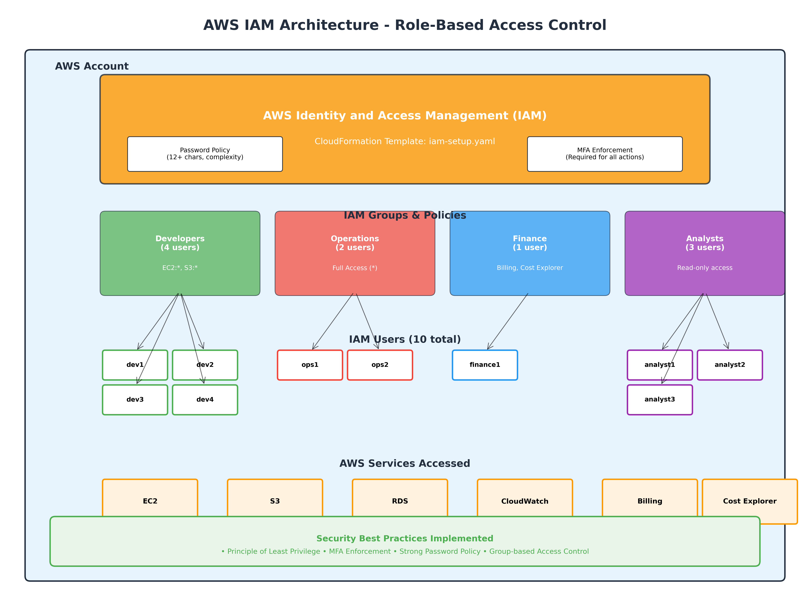

# AWS IAM CloudFormation Setup

A comprehensive AWS Identity and Access Management (IAM) solution implementing role-based access control (RBAC) with security best practices through Infrastructure as Code.

## 🏗️ Architecture Overview

This repository deploys a secure, scalable IAM architecture with:
- **4 IAM Groups** with role-specific permissions
- **10 IAM Users** distributed across groups
- **MFA Enforcement** for all users
- **Strong Password Policy** with complexity requirements
- **Principle of Least Privilege** access control



## 📋 Prerequisites

- AWS CLI configured with appropriate permissions
- AWS account with IAM administrative access
- CloudFormation deployment permissions

## 🚀 Quick Start

### 1. Clone Repository
```bash
git clone <repository-url>
cd aws-iam-cloudformation
```

### 2. Deploy IAM Stack
```bash
aws cloudformation create-stack \
  --stack-name iam-rbac-setup \
  --template-body file://iam-setup.yaml \
  --capabilities CAPABILITY_IAM
```

### 3. Monitor Deployment
```bash
aws cloudformation describe-stacks --stack-name iam-rbac-setup
```

## 👥 IAM Groups & Permissions

| Group | Users | Permissions | Use Case |
|-------|-------|-------------|----------|
| **Developers** | 4 users (dev1-dev4) | EC2:*, S3:* | Development & testing |
| **Operations** | 2 users (ops1-ops2) | Full Access (*) | Infrastructure management |
| **Finance** | 1 user (finance1) | Billing, Cost Explorer | Cost management |
| **Analysts** | 3 users (analyst1-analyst3) | Read-only access | Reporting & analytics |

## 🔐 Security Features

### Password Policy
- **Minimum Length**: 12 characters
- **Complexity**: Requires uppercase, lowercase, numbers, symbols
- **Rotation**: 90-day maximum age
- **History**: Prevents reuse of last 5 passwords

### MFA Enforcement
- **Universal Requirement**: All users must enable MFA
- **Conditional Access**: Denies all actions without MFA except:
  - `iam:CreateVirtualMFADevice`
  - `iam:EnableMFADevice`
  - `iam:GetUser`
  - `iam:ListMFADevices`
  - `sts:GetSessionToken`

## 📊 AWS Services Access Matrix

| Service | Developers | Operations | Finance | Analysts |
|---------|------------|------------|---------|----------|
| EC2 | ✅ Full | ✅ Full | ❌ | 👁️ Read |
| S3 | ✅ Full | ✅ Full | ❌ | 👁️ Read |
| RDS | ❌ | ✅ Full | ❌ | 👁️ Read |
| CloudWatch | ❌ | ✅ Full | ❌ | 👁️ Read |
| Billing | ❌ | ✅ Full | ✅ Full | ❌ |
| Cost Explorer | ❌ | ✅ Full | ✅ Full | ❌ |

## 🛠️ Post-Deployment Setup

### 1. User Onboarding
After stack deployment, each user must:

1. **Set Initial Password**
   ```bash
   aws iam create-login-profile --user-name <username> --password <temp-password> --password-reset-required
   ```

2. **Enable MFA Device**
   - Log into AWS Console
   - Navigate to IAM → Users → Security credentials
   - Assign MFA device (Virtual or Hardware)

### 2. Verification
```bash
# List created users
aws iam list-users

# Verify group memberships
aws iam get-groups-for-user --user-name dev1

# Check MFA devices
aws iam list-mfa-devices --user-name dev1
```

## 📁 Repository Structure

```
aws-iam-cloudformation/
├── iam-setup.yaml              # Main CloudFormation template
├── aws-iam-cloudformation/     # Duplicate template directory
│   └── iam-setup.yaml
├── generate_diagram.py         # Architecture diagram generator
├── aws_iam_architecture.png    # Generated architecture diagram
└── README.md                   # This file
```

## 🔄 Management Operations

### Add New User
```bash
# Create user
aws iam create-user --user-name newuser

# Add to group
aws iam add-user-to-group --user-name newuser --group-name Developers
```

### Update Stack
```bash
aws cloudformation update-stack \
  --stack-name iam-rbac-setup \
  --template-body file://iam-setup.yaml \
  --capabilities CAPABILITY_IAM
```

### Delete Stack
```bash
aws cloudformation delete-stack --stack-name iam-rbac-setup
```

## 🎯 Best Practices Implemented

- ✅ **Infrastructure as Code**: Version-controlled IAM configuration
- ✅ **Least Privilege**: Minimal required permissions per role
- ✅ **Defense in Depth**: Multiple security layers
- ✅ **Separation of Duties**: Role-based access segregation
- ✅ **Audit Trail**: CloudTrail integration for access logging
- ✅ **Scalable Design**: Group-based permission inheritance

## 🚨 Security Considerations

### Important Notes
- **MFA is mandatory** - Users cannot perform actions without MFA
- **Password complexity** is enforced at account level
- **Operations group** has full access - use with caution
- **Regular access reviews** should be conducted
- **CloudTrail logging** recommended for audit compliance

### Compliance
This setup supports compliance with:
- SOC 2 Type II
- ISO 27001
- AWS Security Best Practices
- CIS AWS Foundations Benchmark

## 🛡️ Troubleshooting

### Common Issues

**MFA Not Working**
```bash
# Check MFA device status
aws iam list-mfa-devices --user-name <username>

# Resync MFA device if needed
aws iam resync-mfa-device --user-name <username> --serial-number <device-arn> --authentication-code1 <code1> --authentication-code2 <code2>
```

**Permission Denied**
- Verify user is in correct group
- Ensure MFA is enabled and active
- Check policy attachments

**Stack Deployment Fails**
- Verify IAM permissions for CloudFormation
- Check for naming conflicts
- Review CloudFormation events for specific errors

## 📞 Support

For issues or questions:
1. Check CloudFormation stack events
2. Review IAM policy simulator
3. Consult AWS IAM documentation
4. Contact your AWS administrator

## 📄 License

This project is licensed under the MIT License - see the LICENSE file for details.

---

**⚠️ Security Notice**: This template creates users with programmatic access. Ensure proper credential management and regular rotation of access keys.
