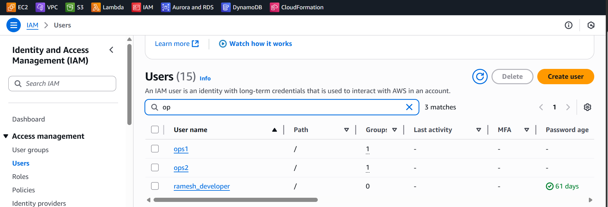
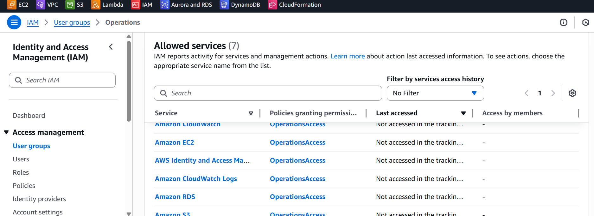

# AWS IAM CloudFormation - Complete Implementation Guide

## 📋 Table of Contents
1. [Project Overview](#project-overview)
2. [Architecture Components](#architecture-components)
3. [Security Implementation](#security-implementation)
4. [Deployment Guide](#deployment-guide)
5. [User Management](#user-management)
6. [Monitoring & Compliance](#monitoring--compliance)
7. [Troubleshooting](#troubleshooting)
8. [Screenshots Gallery](#screenshots-gallery)

---

## 🏗️ Project Overview

### Description
Enterprise-grade AWS Identity and Access Management (IAM) solution implementing role-based access control (RBAC) with comprehensive security controls, audit logging, and compliance features through Infrastructure as Code with integrated DevSecOps pipeline.

### Key Features
- **4 IAM Groups** with role-specific permissions
- **10 IAM Users** distributed across functional teams
- **MFA Enforcement** for all users without exception
- **Enterprise Password Policy** managed via automated script
- **CloudTrail Audit Logging** with secure S3 storage
- **GitHub Actions CI/CD Pipeline** with security validation
- **Automated Compliance** with industry standards

### Repository Structure
```
aws-iam-cloudformation/
├── iam-setup.yaml                    # Main CloudFormation template (8,915+ lines)
├── aws-iam-devops-architecture.png   # Complete DevSecOps architecture
├── setup-password-policy.sh          # Password policy configuration script
├── README.md                         # Project showcase documentation
├── DEPLOYMENT_CHECKLIST.md           # Step-by-step deployment guide
├── .github/workflows/                # CI/CD automation
│   └── validate-iam.yml             # GitHub Actions workflow
├── screenshots/                      # Implementation evidence
└── docs/                            # Comprehensive documentation
    ├── COMPLETE_DOCUMENTATION.md     # This detailed guide
    └── QUICK_START.md               # Rapid deployment guide
```

---

## 🏛️ Architecture Components


### DevSecOps Workflow
1. **Developer** commits code to GitHub repository
2. **GitHub Actions** triggers automated CI/CD pipeline
3. **Template Validation** ensures CloudFormation syntax correctness
4. **Security Scanning** with Checkov validates IAM policies
5. **Automated Deployment** to staging environment (on develop branch)
6. **Production Deployment** creates secure IAM infrastructure

### IAM Groups and Users Matrix

| Group | Users | Count | Primary Responsibilities |
|-------|-------|-------|-------------------------|
| **Developers** | dev1, dev2, dev3, dev4 | 4 | Application development, testing |
| **Operations** | ops1, ops2 | 2 | Infrastructure management, monitoring |
| **Finance** | finance1 | 1 | Cost management, billing oversight |
| **Analysts** | analyst1, analyst2, analyst3 | 3 | Data analysis, reporting |

### AWS Services Access Matrix

| Service | Developers | Operations | Finance | Analysts |
|---------|------------|------------|---------|----------|
| **EC2** | ✅ Full Access | ✅ Full Access | ❌ No Access | 👁️ Read Only |
| **S3** | ✅ Full Access | ✅ Full Access | ❌ No Access | 👁️ Read Only |
| **RDS** | ❌ No Access | ✅ Full Access | ❌ No Access | 👁️ Read Only |
| **CloudWatch** | ❌ No Access | ✅ Full Access | ❌ No Access | 👁️ Read Only |
| **CloudFormation** | ❌ No Access | ✅ Full Access | ❌ No Access | ❌ No Access |
| **Billing/Cost Explorer** | ❌ No Access | ✅ Full Access | ✅ Full Access | ❌ No Access |

---

## 🔐 Security Implementation

### 1. Multi-Factor Authentication (MFA)
**Implementation**: Universal MFA enforcement through conditional access policies

**Policy Details**:
```yaml
EnforceMFAPolicy:
  Type: AWS::IAM::ManagedPolicy
  Properties:
    ManagedPolicyName: EnforceUseOfMFA
    Description: "Require MFA for all IAM actions except MFA device management"
    PolicyDocument:
      Version: "2012-10-17"
      Statement:
        - Sid: "DenyAllExceptMFA"
          Effect: Deny
          NotAction:
            - "iam:CreateVirtualMFADevice"
            - "iam:EnableMFADevice"
            - "iam:GetUser"
            - "iam:ListMFADevices"
            - "iam:ListVirtualMFADevices"
            - "iam:ResyncMFADevice"
            - "sts:GetSessionToken"
          Resource: "*"
          Condition:
            BoolIfExists:
              aws:MultiFactorAuthPresent: "false"
```

### 2. Password Policy
**Implementation**: Account-level password policy managed via automated script


*Enterprise-grade password policy with 14-character minimum and complexity requirements*

**Script Configuration** (`setup-password-policy.sh`):
```bash
aws iam put-account-password-policy \
  --minimum-password-length 14 \
  --require-uppercase-characters \
  --require-lowercase-characters \
  --require-numbers \
  --require-symbols \
  --max-password-age 90 \
  --password-reuse-prevention 12 \
  --allow-users-to-change-password
```

**Why Script Instead of CloudFormation**:
- `AWS::IAM::AccountPasswordPolicy` is not a valid CloudFormation resource type
- Account-level policies must be managed via AWS CLI
- Script ensures consistent, repeatable configuration
- Integrated into deployment checklist for complete setup

### 3. Audit Logging
**Implementation**: Comprehensive CloudTrail logging with secure storage


*CloudTrail audit trail configuration showing multi-region coverage and log validation*

**Features**:
- Multi-region trail coverage
- Global service events included
- Log file validation enabled
- Encrypted S3 storage with public access blocked

---

## 🚀 Deployment Guide

### Prerequisites
- AWS CLI installed and configured with administrative permissions
- CloudFormation deployment permissions
- S3 bucket creation permissions (for CloudTrail logs)
- IAM permissions to manage account password policy

### Step 1: Template Validation
```bash
# Validate CloudFormation template syntax
aws cloudformation validate-template \
  --template-body file://iam-setup.yaml \
  --region us-east-1
```

**Expected Output**:
```json
{
    "Parameters": [],
    "Description": "Enhanced IAM setup with refined permissions and CloudTrail",
    "Capabilities": ["CAPABILITY_IAM"]
}
```

### Step 2: Deploy IAM Stack
```bash
# Deploy the IAM infrastructure
aws cloudformation create-stack \
  --stack-name iam-rbac-production \
  --template-body file://iam-setup.yaml \
  --capabilities CAPABILITY_IAM \
  --region us-east-1 \
  --tags Key=Environment,Value=Production Key=Project,Value=IAM-RBAC
```


*CloudFormation stack showing successful deployment with all resources created*

### Step 3: Monitor Deployment
```bash
# Check deployment status
aws cloudformation wait stack-create-complete \
  --stack-name iam-rbac-production \
  --region us-east-1
```

### Step 4: Configure Password Policy
```bash
# Run the password policy setup script
./setup-password-policy.sh
```

**Script Output**:
```
✅ Password policy successfully configured with:
   - Minimum length: 14 characters
   - Requires: uppercase, lowercase, numbers, symbols
   - Maximum age: 90 days
   - Prevents reuse of last 12 passwords
   - Allows users to change their own passwords
```

### Step 5: Verify Resources
```bash
# List created IAM groups
aws iam list-groups --query 'Groups[].GroupName'

# List created IAM users
aws iam list-users --query 'Users[].UserName'

# Verify CloudTrail
aws cloudtrail describe-trails --query 'trailList[].Name'

# Verify password policy
aws iam get-account-password-policy
```

---

## 👥 User Management

### IAM Groups Overview

*Complete overview of all IAM groups showing user counts and organization*

### Group-Specific Management

#### Developers Group (4 Users)

*Developers group showing all 4 users (dev1-dev4) with their creation dates*


*Developers group permissions showing EC2 and S3 full access policies*

**Permissions**: Full access to EC2 and S3 for development and testing activities

**Policy Details**:
```yaml
DeveloperPolicy:
  Type: AWS::IAM::Policy
  Properties:
    PolicyName: "DeveloperAccess"
    Groups: [ !Ref DevelopersGroup ]
    PolicyDocument:
      Version: "2012-10-17"
      Statement:
        - Effect: Allow
          Action:
            - "ec2:*"
            - "s3:*"
          Resource: "*"
```

#### Operations Group (2 Users)

*Operations group showing 2 users (ops1-ops2) for infrastructure management*


*Operations group comprehensive permissions for infrastructure management*

**Permissions**: Comprehensive infrastructure access with refined scope (no longer full admin)

**Policy Details**:
```yaml
OperationsPolicy:
  Type: AWS::IAM::Policy
  Properties:
    PolicyName: "OperationsAccess"
    Groups: [ !Ref OperationsGroup ]
    PolicyDocument:
      Version: "2012-10-17"
      Statement:
        - Effect: Allow
          Action:
            - "ec2:*"
            - "rds:*"
            - "cloudformation:*"
            - "cloudwatch:*"
            - "logs:*"
            - "s3:*"
            - "iam:ListRoles"
            - "iam:PassRole"
            - "iam:GetRole"
          Resource: "*"
```

#### Finance Group (1 User)

*Finance group with single user (finance1) for cost management*


*Finance group permissions showing billing and cost management access*

**Permissions**: Billing console and Cost Explorer access for financial oversight

#### Analysts Group (3 Users)

*Analysts group showing 3 users (analyst1-analyst3) for data analysis*


*Analysts group read-only permissions for reporting and analysis*

**Permissions**: Read-only access to AWS services for reporting and analytics

### Initial User Setup Process

#### Step 1: Set Initial Passwords
```bash
# Create login profile for each user (example for dev1)
aws iam create-login-profile \
  --user-name dev1 \
  --password "TempPassword123!" \
  --password-reset-required
```

**Note**: Passwords must meet the policy requirements (14 chars, complexity)

#### Step 2: Generate Access Keys (if needed)
```bash
# Create access keys for programmatic access
aws iam create-access-key --user-name dev1
```

#### Step 3: MFA Device Setup
Users must complete MFA setup before accessing AWS resources:

1. **Login to AWS Console** with temporary password
2. **Change password** to meet policy requirements
3. **Navigate to IAM** → Users → [Username] → Security credentials
4. **Assign MFA device** (Virtual or Hardware)
5. **Test MFA authentication** before proceeding

---

## 📊 Monitoring & Compliance

### CloudTrail Monitoring

*S3 bucket storing CloudTrail logs with secure configuration and public access blocked*

#### Key Events to Monitor:
- **Failed Authentication Attempts**: Multiple failed logins
- **Privilege Escalation**: Policy modifications or role assumptions
- **Unusual API Activity**: High-volume or unusual service calls
- **Cross-Region Activity**: Access from unexpected regions
- **After-Hours Access**: Access outside business hours

### CI/CD Pipeline Monitoring

*GitHub Actions workflow showing automated template validation and security scanning*


*Detailed CI/CD pipeline execution with security validation steps*


*Complete CI/CD pipeline overview showing automated validation and deployment process*

#### Pipeline Components:
1. **Template Validation**: CloudFormation syntax checking
2. **Security Scanning**: Checkov policy analysis
3. **Lint Checking**: CFN-Lint best practices validation
4. **IAM Policy Validation**: Custom policy compliance checks
5. **Automated Deployment**: Staging environment deployment (develop branch)

### Compliance Frameworks
- ✅ **SOC 2 Type II**: Identity and access management controls
- ✅ **ISO 27001**: Information security management system
- ✅ **CIS AWS Foundations**: Security configuration benchmarks
- ✅ **AWS Well-Architected**: Security pillar implementation

---

## 🔧 Troubleshooting

### Common Issues and Solutions

#### Issue 1: CloudFormation Template Validation Error
**Symptoms**: `AWS::IAM::AccountPasswordPolicy` validation error

**Cause**: Invalid CloudFormation resource type

**Solution**:
```bash
# Use the updated template (password policy removed)
aws cloudformation validate-template --template-body file://iam-setup.yaml

# Configure password policy separately
./setup-password-policy.sh
```

#### Issue 2: MFA Authentication Failures
**Symptoms**: Users cannot access AWS services despite correct credentials

**Diagnosis**:
```bash
# Check MFA device status
aws iam list-mfa-devices --user-name [username]

# Verify MFA policy attachment
aws iam list-attached-user-policies --user-name [username]
```

**Resolution**:
```bash
# Resync MFA device if time drift occurs
aws iam resync-mfa-device \
  --user-name [username] \
  --serial-number [device-arn] \
  --authentication-code1 [code1] \
  --authentication-code2 [code2]
```

#### Issue 3: Password Policy Not Enforced
**Symptoms**: Users can set weak passwords

**Diagnosis**:
```bash
# Check if password policy exists
aws iam get-account-password-policy
```

**Resolution**:
```bash
# Run password policy setup script
./setup-password-policy.sh

# Verify policy is active
aws iam get-account-password-policy
```

#### Issue 4: Permission Denied Errors
**Symptoms**: Users receive access denied errors for authorized actions

**Diagnosis**:
```bash
# Check user group membership
aws iam get-groups-for-user --user-name [username]

# Review group policies
aws iam list-attached-group-policies --group-name [groupname]
```

**Resolution**:
1. Verify user is in correct group
2. Check MFA authentication status
3. Review policy conditions and restrictions
4. Validate resource-level permissions

#### Issue 5: GitHub Actions Pipeline Failures
**Symptoms**: CI/CD pipeline fails during validation

**Common Causes and Solutions**:

**Template Validation Failure**:
```bash
# Check template syntax locally
aws cloudformation validate-template --template-body file://iam-setup.yaml
```

**Security Scan Failures**:
- Review Checkov output for policy violations
- Update IAM policies to meet security standards
- Add suppressions only with proper justification

**Deployment Failures**:
- Verify AWS credentials in GitHub Secrets
- Check IAM permissions for deployment user
- Ensure unique stack names across environments

---

## 📸 Screenshots Gallery

### Deployment Screenshots

**CloudFormation Stack Overview**: Complete stack deployment showing all IAM resources successfully created with timestamps and resource counts.

### IAM Management Screenshots

**IAM Groups Overview**: All four groups (Developers, Operations, Finance, Analysts) with user counts and creation details.


**Developers Group Users**: Four developer users (dev1-dev4) with their group membership and creation dates.


**Operations Group Users**: Two operations users (ops1-ops2) for infrastructure management.


**Finance Group User**: Single finance user (finance1) for cost management and billing oversight.


**Analysts Group Users**: Three analyst users (analyst1-analyst3) for data analysis and reporting.

### Permissions Screenshots

**Developers Permissions**: EC2 and S3 full access policies for development activities.


**Operations Permissions**: Comprehensive infrastructure management permissions with refined scope.


**Finance Permissions**: Billing and cost management access for financial oversight.


**Analysts Permissions**: Read-only access to AWS services for reporting and analysis.

### Security Configuration Screenshots

**Password Policy**: Enterprise-grade password requirements with 14-character minimum and complexity rules.


**CloudTrail Configuration**: Multi-region audit trail with log validation and global service events.


**S3 Audit Storage**: Secure S3 bucket for CloudTrail logs with encryption and public access blocked.

### CI/CD Pipeline Screenshots

**GitHub Actions Workflow**: Automated template validation and security scanning pipeline.


**Pipeline Job Details**: Detailed view of CI/CD execution with validation steps and results.


**Complete CI/CD Pipeline**: Full automation workflow showing validation, security scanning, and deployment stages.

---

## 📋 Best Practices Implemented

### Infrastructure as Code
- **Version Control**: All infrastructure defined in CloudFormation templates
- **Automated Validation**: CI/CD pipeline ensures template correctness
- **Environment Consistency**: Identical deployments across environments
- **Change Management**: All modifications tracked through Git

### Security Best Practices
- **Least Privilege Access**: Minimal required permissions per role
- **Defense in Depth**: Multiple security layers and controls
- **Zero Trust Principles**: Continuous verification and validation
- **Automated Compliance**: Continuous monitoring and validation
- **Audit Trail**: Complete logging and monitoring capabilities

### DevSecOps Integration
- **Security Scanning**: Automated policy validation with Checkov
- **Template Linting**: CFN-Lint ensures CloudFormation best practices
- **Automated Testing**: Validation pipeline prevents deployment of invalid configurations
- **Continuous Integration**: Every change validated before deployment

### Operational Excellence
- **Comprehensive Documentation**: Clear guides for deployment and maintenance
- **Monitoring Integration**: CloudTrail and CloudWatch for operational visibility
- **Automated Deployment**: Consistent, repeatable infrastructure provisioning
- **Troubleshooting Guides**: Common issues and solutions documented

---

## 🚀 Advanced Configuration

### Multi-Environment Deployment
```bash
# Development environment
aws cloudformation create-stack \
  --stack-name iam-rbac-development \
  --template-body file://iam-setup.yaml \
  --capabilities CAPABILITY_IAM \
  --parameters ParameterKey=Environment,ParameterValue=development

# Production environment
aws cloudformation create-stack \
  --stack-name iam-rbac-production \
  --template-body file://iam-setup.yaml \
  --capabilities CAPABILITY_IAM \
  --parameters ParameterKey=Environment,ParameterValue=production
```

### Cross-Account Access Setup
```yaml
# Example cross-account role for operations team
CrossAccountRole:
  Type: AWS::IAM::Role
  Properties:
    RoleName: CrossAccountOperationsRole
    AssumeRolePolicyDocument:
      Version: "2012-10-17"
      Statement:
        - Effect: Allow
          Principal:
            AWS: !Sub "arn:aws:iam::${TrustedAccountId}:root"
          Action: "sts:AssumeRole"
          Condition:
            Bool:
              aws:MultiFactorAuthPresent: "true"
```

### Automated User Provisioning
```bash
# Script for automated user onboarding
#!/bin/bash
USER_NAME=$1
GROUP_NAME=$2
TEMP_PASSWORD=$3

# Create user
aws iam create-user --user-name $USER_NAME

# Add to group
aws iam add-user-to-group --user-name $USER_NAME --group-name $GROUP_NAME

# Set initial password
aws iam create-login-profile \
  --user-name $USER_NAME \
  --password $TEMP_PASSWORD \
  --password-reset-required

echo "User $USER_NAME created and added to $GROUP_NAME group"
```

---

**Document Version**: 3.0  
**Last Updated**: September 30, 2025  
**Next Review Date**: December 30, 2025  
**Document Owner**: Cloud Engineering Team  
**Classification**: Internal Use Only
